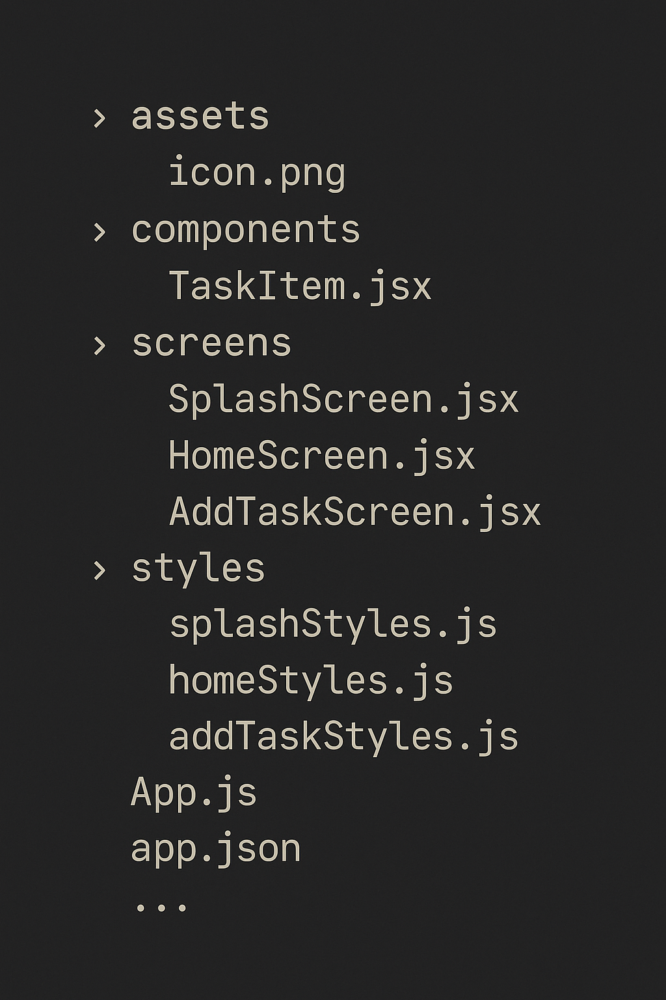
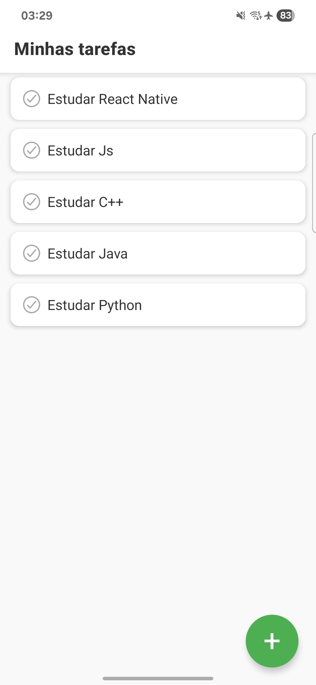
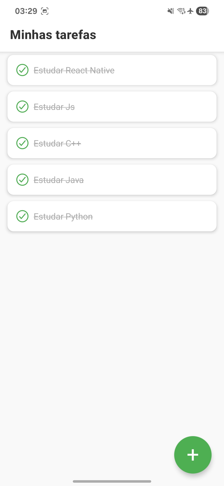
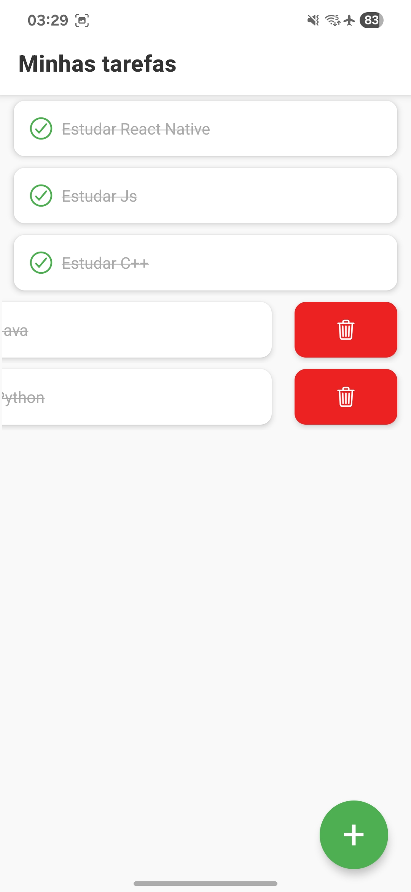

# 📋 AnyTask

**AnyTask** é um aplicativo simples de lista de tarefas desenvolvido com **React Native** e **Expo**. Ele permite adicionar, concluir e excluir tarefas de forma prática e eficiente, ideal para organização pessoal do dia a dia.

---

## ✨ Funcionalidades

- ✅ Adicionar novas tarefas com descrição.
- ✔️ Marcar tarefas como concluídas.
- ❌ Excluir tarefas deslizando para o lado.
- 💾 Armazenamento local usando AsyncStorage.
- 💡 Interface responsiva e intuitiva.
  
---

## 🧱 Estrutura de Pastas

<p align="left">
  
</p>

---

## 📱 Preview

<table>
  <tr>
    <td></td>
    <td></td>
    <td></td>
    <td></td>
  </tr>
</table>

---

## ⚙️ Tecnologias utilizadas

- [React Native](https://reactnative.dev/)
- [Expo](https://expo.dev/)
- [AsyncStorage](https://react-native-async-storage.github.io/async-storage/)
- [React Navigation](https://reactnavigation.org/)
- [react-native-gesture-handler](https://docs.swmansion.com/react-native-gesture-handler/)
- [expo/vector-icons](https://icons.expo.dev/)

---

## 🚀 Como executar o projeto

1. Clone o repositório:

```
git clone https://github.com/seu-usuario/trabalho-de-extensao.git
```

2. Navegue até o diretório:

```
cd AnyTask
```

3. Instale as dependências:
   
```
npm install
```

4. Inicie o projeto com o Expo:

```
npx expo start
```

---

## 🧑‍💻 Autor

- **Erik Santos Silva**

Projeto desenvolvido como parte de uma atividade acadêmica de extensão.
Sinta-se à vontade para contribuir ou fazer um fork!
